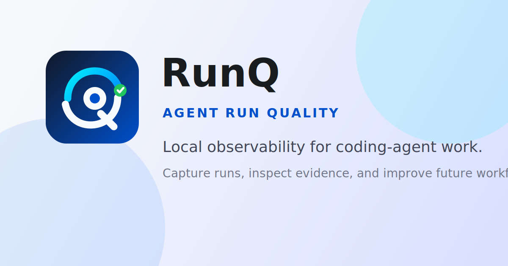

# RunQ

Open protocol and local collector for agent run quality.

RunQ captures what an agent did, reconstructs the run as an inspectable trace, scores whether the result is trustworthy, and turns weak spots into evidence-backed recommendations.

> When agents start doing real work, RunQ answers the operational question: did this run actually hold up?



## Status

RunQ is an Apache-2.0 open source project in `0.2.x` local alpha.

Use it today to collect local agent-run metadata, inspect timelines, review task workflows, score run trust, and test recommendation loops. The `0.x` protocol and schema can change before `1.0`.

## Why RunQ

AI agents now call models, use tools, execute shell commands, request permissions, edit files, call MCP servers, invoke skills, and hand work back to humans. Generic LLM observability can show model traces, but it usually does not answer:

- What did the agent actually do from request to result?
- Which tools, MCP servers, skills, files, and verifications were involved?
- Is the result trustworthy enough to ship, accept, or automate?
- What workflow change would make future runs more reliable?

RunQ focuses on the full agent run, not just the LLM call.

## 3-Minute Local Preview

Requirements: Node.js `>=22.5.0`.

```bash
npm install
node src/cli.js demo --db .runq/demo.db
npm run inbox -- --db .runq/demo.db --port 4545
```

Open `http://localhost:4545`.

The demo database includes successful, failed, needs-review, and follow-up sessions so Agents, Sessions, Traces, Evaluations, Recommendations, Setup, and Docs have realistic local data before you connect an agent.

For the full path, see [docs/quickstart.md](docs/quickstart.md).

## What You Get

- **Run Summary**: user request, execution path, call footprint, verification result, and RunQ Trust Score.
- **Workflow trace**: model calls, regular tools, MCP tools, skills, commands, file changes, verification, and outcome as a task flow.
- **RunQ Trust Model**: a single trust score plus evidence strength, verification strength, execution quality, autonomy reliability, cost discipline, and risk exposure.
- **Recommendation loop**: evidence-backed recommendations with accept/dismiss decisions and follow-up impact tracking.
- **Local-first privacy**: metadata-first capture with default redaction before events are persisted.
- **Agent adapters**: Claude Code, Codex, OpenClaw, and Hermes surfaces.

## Core Concepts

RunQ standardizes:

- `Session`: a continuous interaction with an agent runtime.
- `Task`: a user goal inside a session.
- `Event`: raw telemetry evidence such as model, tool, command, file, verification, or feedback events.
- `Workflow node`: a visualized step derived from raw events.
- `Run Summary`: a deterministic explanation generated from structured events.
- `RunQ Trust Score`: RunQ's current estimate of whether the run held up.
- `Trust Breakdown`: six explainable dimensions behind the score.
- `Recommendation`: a workflow improvement backed by evidence events.

Read [docs/concepts.md](docs/concepts.md) before building an adapter or changing scoring behavior.

## Connect Agents

Configure every supported local surface:

```bash
node src/cli.js init all --db .runq/runq.db
node src/cli.js doctor --db .runq/runq.db
```

Or configure one surface:

```bash
node src/cli.js init claude-code --db .runq/runq.db
node src/cli.js init codex --db .runq/runq.db
node src/cli.js init openclaw --db .runq/runq.db
node src/cli.js init hermes --db .runq/runq.db
```

`runq init codex` enables Codex command hooks with `codex_hooks = true` and also writes the legacy `notify` entry as a compatibility fallback. Hooks capture session, prompt, tool, command, and stop events; notify-only configs can only capture turn completion.

OpenClaw supports a native reporter plugin and JSONL import:

```bash
node src/cli.js import-openclaw ~/.openclaw/agents/main/sessions/<session-id>.jsonl --db .runq/runq.db
npm run openclaw:reporter -- --once --db .runq/runq.db
```

## Protocol

RunQ is both a product workbench and an open event protocol.

Start with:

- [protocol/protocol-v0.md](protocol/protocol-v0.md)
- [protocol/events.schema.json](protocol/events.schema.json)
- [docs/arq-standard.md](docs/arq-standard.md)
- [docs/concepts.md](docs/concepts.md)

Protocol changes should update the schema, validation logic, tests, and examples together.

## Development

```bash
npm test
npm run build
npm run test:e2e
```

Run the open source release gate:

```bash
npm test
npm run build
npm run test:e2e
npm run release-check
npm audit --omit=dev
env npm_config_cache=.tmp/npm-cache npm pack --dry-run
```

Run product harnesses:

```bash
npm run harness:openclaw -- --scenario verified-success --db .runq/openclaw-harness.db
npm run harness:openclaw -- --scenario repeated-test-failure --db .runq/openclaw-harness.db
npm run harness:coding-task -- --db .runq/coding-task.db --repo .runq/coding-task-repo
```

## Local Privacy Defaults

RunQ stores metadata-first telemetry by default. Sensitive fields such as raw prompts, command strings, command output, token-looking strings, passwords, and API keys are redacted before events are persisted. Normalized adapters preserve hashes, lengths, binary names, exit codes, durations, and verification flags so scoring still works without storing raw private content.

Use `privacy.level = "sensitive"` or `privacy.level = "secret"` only when an integration has seen raw private content. The local collector will downgrade stored events to metadata after redaction unless a future explicit opt-in policy changes that behavior.

## Project Links

- Quickstart: [docs/quickstart.md](docs/quickstart.md)
- Concepts: [docs/concepts.md](docs/concepts.md)
- Roadmap: [ROADMAP.md](ROADMAP.md)
- Changelog: [CHANGELOG.md](CHANGELOG.md)
- Contributing: [CONTRIBUTING.md](CONTRIBUTING.md)
- Security: [SECURITY.md](SECURITY.md)
- Support: [SUPPORT.md](SUPPORT.md)
- Release process: [RELEASE.md](RELEASE.md)
- License: [Apache-2.0](LICENSE)

## Public Preview Readiness

RunQ can be published as a local alpha when the release gate passes. A broader developer preview still requires more real-session evidence:

- 5 external users capture real sessions.
- At least 50 real sessions are ingested.
- At least 80 percent of sessions reconstruct a usable timeline.
- At least 3 users act on one recommendation.
- No sensitive-data leak is found in default metadata mode.
- `node src/cli.js readiness --db .runq/runq.db --json` reports `ready_for_public_preview: true`.
